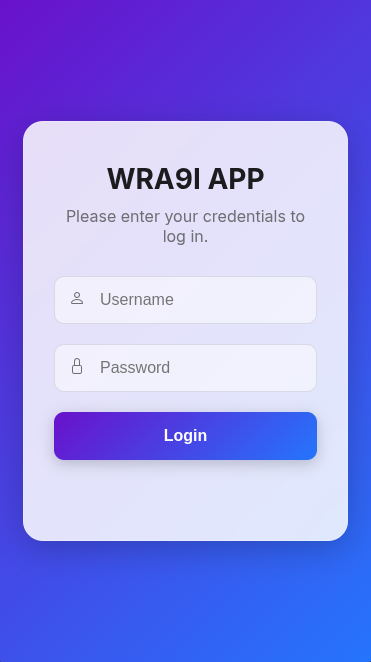
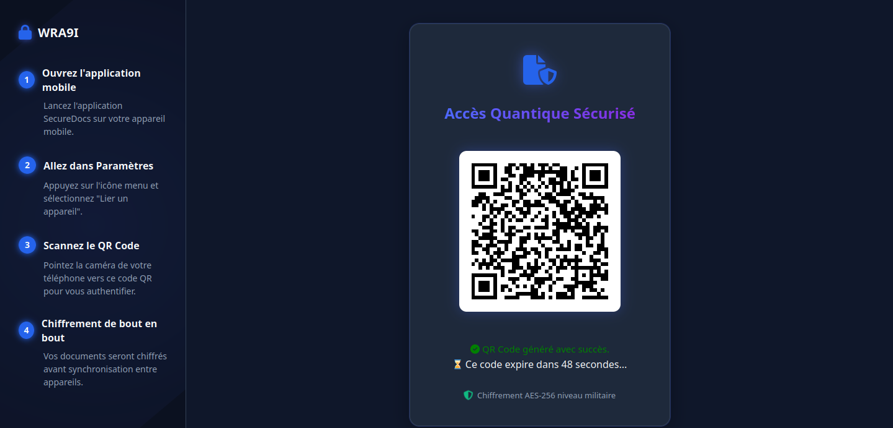
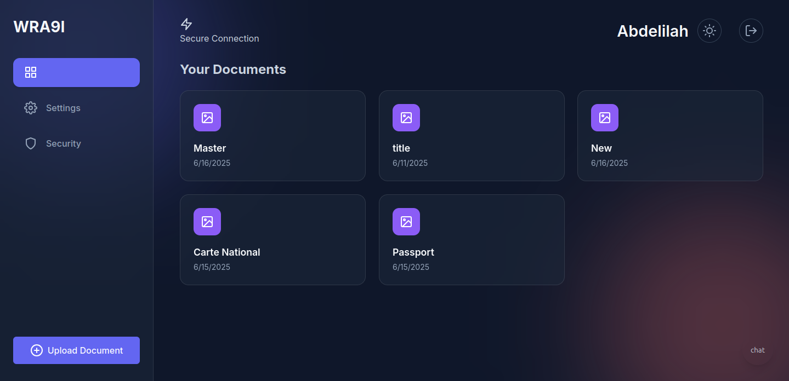

# Digital Documents Wallet – PFE 2024/2025

A secure and modern **digital wallet for personal documents** – built for the **graduation project (PFE)** of *BTS Développement des Systèmes d'Information* 2024/2025.

---

## 📸 Screenshots

| Android Login (Secure)                          | Web QR Code Login                          | Dashboard                                       |
|-------------------------------------------------|--------------------------------------------|-------------------------------------------------|
|  |  |  |

---

## Tech Stack

| Layer | Technology |
|-------|------------|
| Backend | Java + Spring Boot |
| Security | Spring Security + JWT + AES + RSA |
| Frontend (Web) | HTML, CSS, JavaScript, Bootstrap |
| Frontend (Mobile) | Android (XML, Java) |
| Database | PostgreSQL |
| Server | Linux (Contabo) |
| Hosting | Self-hosted, Nginx + PM2 |

---

Cryptography Flow (Simplified)
I use hybrid encryption to protect user documents:
1. Generate AES Key (for document)
2. Encrypt AES key using user's RSA public key
3. Store (Encrypted File + Encrypted AES key)
4. On view: decrypt AES key using RSA private key, then decrypt file

See EncryptionUtils.java & RSAKeyService.java for full implementation.
